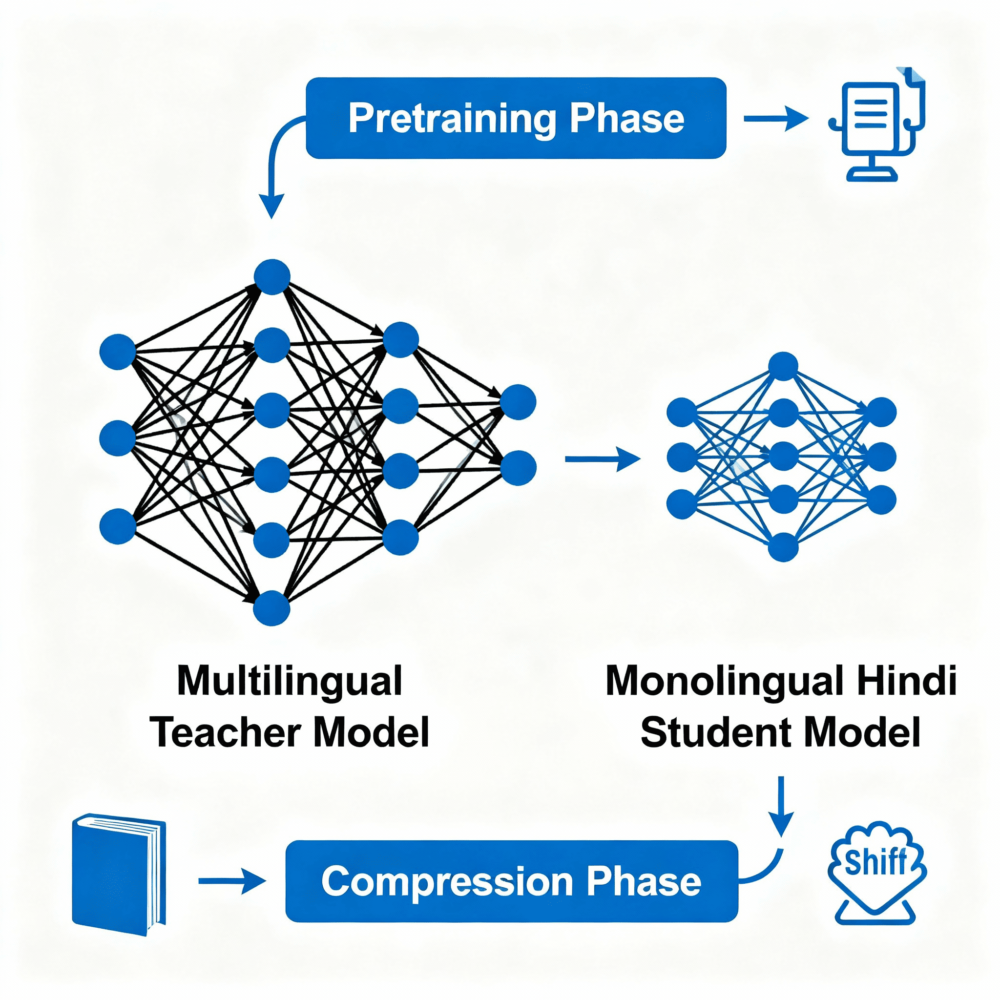

### Pretrain Distilling Mono-lingual models

  
  
  
  

We are currently trying to do distillation of multilingual models to mono lingual ones starting with hindi langauge. This distillation happens during pre-training so the teacher now sort of acts as a guide during pre-training and thus we can have higher compression ratios as well. 

The current progress is that we have pretrained distilled a `Hindi` model from `XLMRobertaBase` with comopression ratio of around 8x and further improving it to 20x so that we can have a mono lingual model which performs as good as `XLMRoberta` for low resource and moderate resource languages. 

🔗 **Model**: [kkkamur07/hindi-xlm-roberta-33M](https://huggingface.co/kkkamur07/hindi-xlm-roberta-33M) (with detailed model card)

We are currently getting `perplexity` of around 18 on hindi and XLM Roberta base gets around 5 and we will close this gap soon and setup more robust evaluations pipeline in the future with suprising things as the model gives us perplexity in english to be around 50 while the XLM Robert Base has around 2 same, so essentially the model is forgetting things in english. 

We have currently trained it on 100M tokens of hindi

### Future improvements : 
- [X] Robust Evaluations pipeline
- [ ] Redue the vocabulary of tokenizer from 250004 to only hindi words
- [X] Add FlashAttention, ROPE so that you can have more fine grained control of the student's architecture
- [ ] Adaptive temperature and alpha scaling with some regularization in the loss so that model can generalize well. 
- [X] Varied & Diverse data and increase data
- [X] Cache the tokens because it takes a lot of time 
- [ ] Teacher model should be studied in detail
- [X] More control over the hyperparameters
- [ ] CUDA Kernel to accelerate training
- [X] Future research directions on data bias inheritance from teacher model and how to mitigate this ? 
- [X] Add robust logging to MLFlow and others
- [ ] Fisher Divergence instead of cross entropy

## 🎯 End Goal

Our end goal is to develop high-quality, efficient models for all **22 Indic languages** as specified by the Constitution of India. Throughout this process, we aim to identify what works best for low-resource language modeling.

### Philosophy

**Start simple, work our way up.**

We believe in:
1. **Iterative improvement**: Start with basic distillation, then add complexity
2. **Empirical validation**: Every improvement must be measured and validated
3. **Open research**: Share findings, models, and code with the community
4. **Practical deployment**: Focus on models that can run on edge devices

---

  <strong>🔬 Research in Progress 🔬</strong>
   
  <em>Building efficient monolingual models for Indic languages, one language at a time.</em>
    
  <a href="https://huggingface.co/kkkamur07/hindi-xlm-roberta-33M">🤗 Model</a> •
  <a href="https://github.com/yourusername/slm-distill">💻 GitHub</a> •
  <a href="mailto:your.email@example.com">📧 Contact</a>

---

In addition to this Read_me summary, we have also created a short motivation, summary and outline for the project [in this google document](https://docs.google.com/document/d/1GsuYQtNDsrcAVk2r7jYUC8pDGk-cSKnhXMTzKyyU_NM/edit?tab=t.0).
