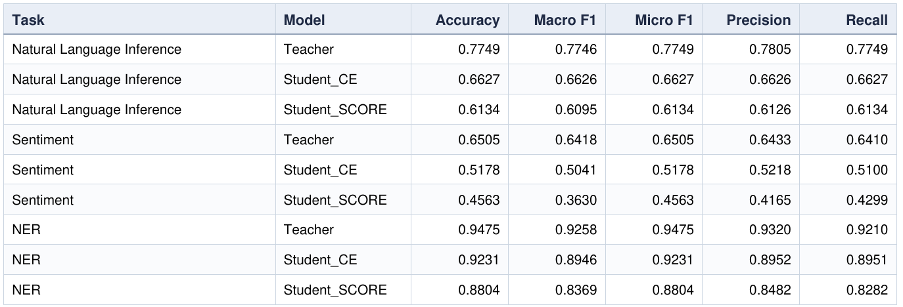

### Pretrain Distilling Mono-lingual models

<div align="center">
  
  
  
  
</div>

## 🚀 Getting Started

### Repository Structure

The `src/` directory contains all the core modules for the distillation pipeline:

- **`src/main.py`**: Main entry point for training and distillation
- **`src/data/`**: Data loading and preprocessing modules
  - `nativeSLM.py`: Dataset class for loading and tokenizing parquet files
  - `eval_prepare.py`: Helper functions for preparing evaluation datasets
- **`src/models/`**: Teacher and student model definitions
  - `teacher_model.py`: XLM-RoBERTa teacher model wrapper
  - `student_model.py`: Compressed student model architecture
- **`src/training/`**: Training utilities and components
  - `trainer.py`: Main distillation trainer with training loop
  - `loss.py`: Distillation loss functions (KD, CE, score matching)
  - `scheduler.py`: Learning rate schedulers
  - `logging.py`: Training logging and metrics tracking
  - `checkpointing.py`: Model checkpoint management
  - `accumulator.py`: Gradient accumulation and AMP utilities
- **`src/evals/`**: Evaluation and benchmarking modules
  - `evals.py`: Basic perplexity and accuracy evaluation
  - `mtp_perplexity_eval.py`: Masked token prediction evaluation
  - `ner_eval.py`: Named Entity Recognition evaluation
  - `nli_eval.py`: Natural Language Inference evaluation
  - `sentiment_eval.py`: Sentiment analysis evaluation
  - `post_train_evals_run.py`: Post-training evaluation orchestrator

### Setup

1. **Clone the repository**:
```bash
git clone <repository-url>
cd slm-distill
```

2. **Create and activate virtual environment**:
```bash
python -m venv .venv
source .venv/bin/activate  # On macOS/Linux
# or
.venv\Scripts\activate  # On Windows
```

3. **Install dependencies**:
```bash
uv sync
```

4. **Configure your experiment**:
Edit `configs/config.yaml` to set your paths, hyperparameters, and model configurations.

### Running the Project

#### Basic Training
Run the distillation training with default configuration:
```bash
python -m src.main
```

#### Hyperparameter Optimization
Run hyperparameter sweep using Optuna (multi-run mode):
```bash
python -m src.main -m --config-name=sweep_config
```

For background execution:
```bash
nohup python -m src.main -m --config-name=sweep_config > sweep.log 2>&1 &
```

#### Configuration Options
- Use `configs/config.yaml` for single training runs
- Use `configs/sweep_config.yaml` for hyperparameter optimization
- All configurations are managed via Hydra

---

We are currently trying to do distillation of multilingual models to mono lingual ones starting with hindi langauge. This distillation happens during pre-training so the teacher now sort of acts as a guide during pre-training and thus we can have higher compression ratios as well. 

The current progress is that we have pretrained distilled a `Hindi` model from `XLMRobertaBase` with comopression ratio of around 8x and further improving it to 20x so that we can have a mono lingual model which performs as good as `XLMRoberta` for low resource and moderate resource languages. 

🔗 **Model**: [kkkamur07/hindi-xlm-roberta-33M](https://huggingface.co/kkkamur07/hindi-xlm-roberta-33M) (with detailed model card)

We are currently getting `perplexity` of around 18 on hindi and XLM Roberta base gets around 5 and we will close this gap soon and setup more robust evaluations pipeline in the future with suprising things as the model gives us perplexity in english to be around 50 while the XLM Robert Base has around 2 same, so essentially the model is forgetting things in english. 

We have currently trained it on 100M tokens of hindi

## 📊 Results

Our pre-trained distilled model has been evaluated on three downstream tasks to assess its capability in understanding Hindi language:

<div align="center">
  
</div>

The evaluation results demonstrate the model's performance across:
- **NLI (Natural Language Inference)**: Tests the model's ability to understand relationships between premise and hypothesis sentences
- **Sentiment Analysis**: Measures accuracy in classifying text sentiment (positive/negative/neutral)
- **NER (Named Entity Recognition)**: Evaluates the model's capability to identify and classify named entities in Hindi text

These benchmarks provide insights into how well the distilled 33M parameter model retains the knowledge from the larger XLM-RoBERTa teacher model across various language understanding tasks.

### Future improvements : 
- [X] Robust Evaluations pipeline
- [ ] Redue the vocabulary of tokenizer from 250004 to only hindi words
- [X] Add FlashAttention, ROPE so that you can have more fine grained control of the student's architecture
- [ ] Adaptive temperature and alpha scaling with some regularization in the loss so that model can generalize well. 
- [X] Varied & Diverse data and increase data
- [X] Cache the tokens because it takes a lot of time 
- [ ] Teacher model should be studied in detail
- [X] More control over the hyperparameters
- [ ] CUDA Kernel to accelerate training
- [X] Future research directions on data bias inheritance from teacher model and how to mitigate this ? 
- [X] Add robust logging to MLFlow and others
- [ ] Fisher Divergence instead of cross entropy

## 🎯 End Goal

Our end goal is to develop high-quality, efficient models for all **22 Indic languages** as specified by the Constitution of India. Throughout this process, we aim to identify what works best for low-resource language modeling.

### Philosophy

**Start simple, work our way up.**

We believe in:
1. **Iterative improvement**: Start with basic distillation, then add complexity
2. **Empirical validation**: Every improvement must be measured and validated
3. **Open research**: Share findings, models, and code with the community
4. **Practical deployment**: Focus on models that can run on edge devices

---

<div align="center">
  <strong>🔬 Research in Progress 🔬</strong>
  <br>
  <em>Building efficient monolingual models for Indic languages, one language at a time.</em>
  <br><br>
  <a href="https://huggingface.co/kkkamur07/hindi-xlm-roberta-33M">🤗 Model</a> •
  <a href="https://github.com/yourusername/slm-distill">💻 GitHub</a> •
  <a href="mailto:your.email@example.com">📧 Contact</a>
</div>

---

In addition to this Read_me summary, we have also created a short motivation, summary and outline for the project [in this google document](https://docs.google.com/document/d/1GsuYQtNDsrcAVk2r7jYUC8pDGk-cSKnhXMTzKyyU_NM/edit?tab=t.0).

### Command for running sweep using optuna
```python
python3 -m src.main -m --config-name=sweep_config
nohup python3 -m src.main -m --config-name=sweep_config > sweep.log 2>&1 &
```

If you are doing sweep i.e. abaltion studies, then make sure that you check the configs throughly
1. The total steps should be less than 10000 for CE loss and 5000 for score based losses because saying from previous training experience, they seem to converge mostly and set epoch to null
2. The optimzer should not include optimizing the score based projections, created a different set of optimizers for that
3. Make sure you return best_val_loss if you are doing sweep. 
4. Set the load_from_checkpoint to false and the checkpoint directory to something else, already commented.